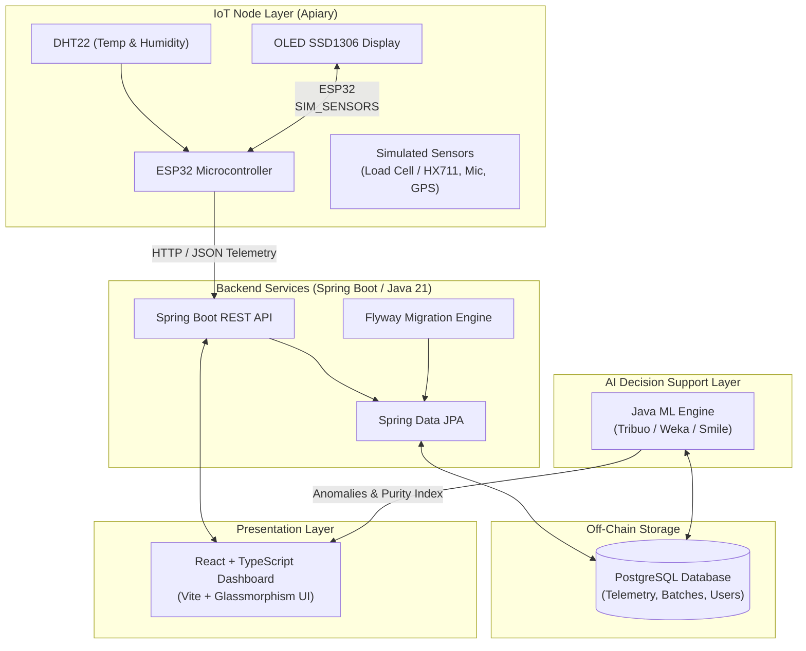
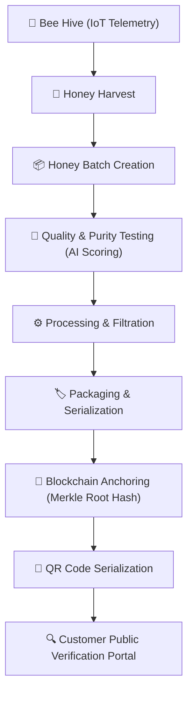

# HoneyChain Architecture & Design Specification 🍯🔗

> **SIH Problem Statement:** SIH26021  
> **Title:** Honey Chain: A blockchain-based system for honey traceability and smart beekeeping management  
> **Team:** Nexora  

---

## 1. System Technology Pipeline Diagram

The system collects raw environmental data from IoT nodes, ingests telemetry via Spring Boot API services, stores off-chain state in PostgreSQL, executes AI decision-support algorithms, and renders real-time insights on the React Dashboard.

---

## 2. Honey Traceability & Verification Lifecycle Flow

From apiary harvesting to consumer QR verification, every stage transitions state off-chain while anchoring critical hashes on-chain.

---

## 3. Data Segregation: Off-Chain vs. On-Chain

To optimize storage cost and maintain transaction throughput:

```mermaid
graph LR
    subgraph OffChain["Off-Chain Data (PostgreSQL)"]
        direction TB
        OC1["High-frequency IoT Telemetry (Temp, Humidity, Weight, Acoustics)"]
        OC2["User Accounts & Roles (Beekeeper, Lab Tech, Auditor)"]
        OC3["Raw Lab Analysis Reports & Spectrogram Data"]
        OC4["Facility Processing Logs & Temperature Curves"]
    end

    subgraph OnChain["On-Chain Data (Blockchain Layer)"]
        direction TB
        ON1["Batch Merkle Root Hashes"]
        ON2["Harvest Date & Floral Source Verification"]
        ON3["Lab Purity Certificate Hash & Status"]
        ON4["Jar QR Serial Number Verification Proof"]
    end

    OffChain -- "Cryptographic Hash Commitment" --> OnChain
```

---

## 4. Architectural Principles & Scientific Decision Support

1. **Decision Support Language Policy**:
   - Sensor alerts avoid absolute diagnostic claims.
   - Example Output: `"Abnormal hive pattern detected. Beekeeper inspection recommended."`
2. **Local Blockchain Abstraction**:
   - The blockchain component provides a generic `BlockchainAdapter` interface.
   - Allows local EVM development nodes (Hardhat/Ganache) to be swapped with Ethereum Sepolia, Polygon, or Hyperledger Fabric.
