# HoneyChain Architecture & Design Specification 🍯🔗

> **SIH Problem Statement:** SIH26021  
> **Title:** Honey Chain: A blockchain-based system for honey traceability and smart beekeeping management  
> **Team:** Nexora  

---

## 1. System Technology Pipeline Diagram

The HoneyChain platform ingests real-time environmental telemetry from physically installed IoT nodes via Spring Boot REST services, stores off-chain state in PostgreSQL, executes AI-assisted screening decision support, and renders live monitoring on the React Dashboard.

```mermaid
flowchart TD
    subgraph IoT_Layer["Physical IoT Node Layer (Apiary)"]
        ESP32["ESP32 Microcontroller"]
        DHT22["DHT22 (Temp & Humidity)"]
        OLED["SSD1306 OLED Display"]
        
        DHT22 --> ESP32
        OLED <-- ESP32
    end

    subgraph Backend_Layer["Backend Services (Spring Boot / Java 21)"]
        API["Spring Boot REST API"]
        FLYWAY["Flyway Migration Engine"]
        JPA["Spring Data JPA"]

        API --> JPA
        FLYWAY --> JPA
    end

    subgraph Data_Storage["Off-Chain Storage"]
        PGDB[("PostgreSQL Database\n(Telemetry, Batches, Quality, Users)")]
        JPA <--> PGDB
    end

    subgraph AI_Engine["AI Decision Support Layer"]
        AI_RULE["AI-Assisted Screening Engine\n(Rule-Based & Threshold Evaluation)"]
        AI_RULE <--> PGDB
    end

    subgraph User_Interface["Presentation Layer"]
        DASHBOARD["React + TypeScript Dashboard\n(Vite + Glassmorphism UI)"]
        API <--> DASHBOARD
    end

    ESP32 -- "HTTP / JSON Telemetry (Temp, Humidity)" --> API
    AI_RULE -- "Anomalies & Screening Recommendations" --> DASHBOARD
```

---

## 2. Authoritative Current Physical Hardware & Sensor Data

### 🟢 Installed Physical Hardware
- **ESP32 Microcontroller**: Main 240MHz dual-core node managing Wi-Fi connectivity, NTP time synchronization, and HTTP JSON telemetry ingestion.
- **DHT22 / AM2302 Sensor**: Measures hive environmental **Temperature (°C)** and **Relative Humidity (%)**.
- **SSD1306 OLED Display**: Local 128x64 I2C display rendering real-time local telemetry readings and Wi-Fi connection diagnostics.

### 🟡 Optional / Nullable API Data Fields
- **Weight & Sound Level**: Supported as nullable schema fields in the backend API for forward compatibility. When physical telemetry is received without these sensors, `weight` and `soundLevel` are set to `null`.
- **Acoustic Data UI Display**: When `soundLevel` is `null`, the system displays: `"Acoustic data unavailable — microphone not installed."`

### 🔮 Future Hardware Extensions (Deferred / Not Installed)
- **HX711 + Load Cell**: Automated real-time hive weight monitoring (Future Extension).
- **INMP441 Microphone**: Acoustic swarm audio analysis & piping detection (Future Extension).
- **SIM7000G / GPS Module**: Hardware-based GPS location tracking (Future Extension).

---

## 3. End-to-End Traceability & Verification Lifecycle Flow

```text
PHYSICAL APIARY

ESP32
  │
  ├── DHT22
  │     ├── Temperature
  │     └── Humidity
  │
  └── SSD1306 OLED
        │
        ▼
IoT Telemetry
        │
        ▼
Spring Boot REST API
        │
        ▼
PostgreSQL
        │
        ├───────────────┐
        │               │
        ▼               ▼
Hive Monitoring     Sensor History
        │
        ▼
AI-Assisted Anomaly Screening
        │
        ▼
NORMAL / WARNING / CRITICAL
        │
        ▼
Beekeeper Inspection
        │
        ▼
HARVEST
        │
        ▼
Honey Batch
(Manual Harvest Quantity)
        │
        ▼
Quality Testing
        │
        ▼
AI-Assisted Quality Screening
        │
        ▼
Processing Records
        │
        ▼
Ready for Packaging
        │
        ▼
Package ID
        │
        ▼
Future QR Verification
        │
        ▼
Future Blockchain Anchoring
        │
        ▼
Consumer Verification Portal
```

---

## 4. Data Segregation: Off-Chain PostgreSQL vs. Future On-Chain

To optimize storage cost and maintain system performance, raw high-frequency data is maintained off-chain, while cryptographic commitments are designated for future on-chain anchoring.

```mermaid
graph LR
    subgraph OffChain["Off-Chain Data (PostgreSQL)"]
        direction TB
        OC1["User Accounts & Roles (Beekeeper, Inspector, Admin)"]
        OC2["Farms & Hives (Registered Metadata)"]
        OC3["High-frequency IoT Telemetry (Temp & Humidity)"]
        OC4["Honey Batches (Manual Harvest Quantity)"]
        OC5["Quality Tests (Lab Parameters)"]
        OC6["Processing Records (Filter & Thermal Logs)"]
        OC7["Packages (Serial Numbers & Net Quantity)"]
        OC8["AI Alerts & Traceability Events"]
    end

    subgraph FutureOnChain["Future On-Chain Data (Blockchain Layer)"]
        direction TB
        ON1["Cryptographic Commitments & Event Hashes"]
        ON2["Important Traceability Event Proofs"]
        ON3["Package & Batch Verification Proof"]
    end

    OffChain -- "Cryptographic Hash Generation" --> FutureOnChain
```



---

## 5. Architectural Principles & Scientific Decision Support

1. **Hive Temperature/Humidity vs. Honey Moisture**:
   - **Hive Environmental Humidity**: Physically measured by DHT22 sensor inside the hive super (`humidity %`).
   - **Honey Moisture Content**: Chemical laboratory measurement evaluated during quality testing (`moisture %`).
   - *Strict Rule*: Environmental hive humidity is never confused with honey moisture content. Harvest readiness is determined by beekeeper inspection and observations.

2. **Harvest Quantity Entry**:
   - Since load-cell hardware is not installed, honey harvest weight/volume is entered manually by the beekeeper as **"Manual Harvest Quantity"**.
   - The system does not claim real-time automated hive weight measurement.

3. **Location Metadata**:
   - Farm and hive locations are stored as **"Registered Farm/Hive Location"** (administrative metadata set during registration).
   - Hardware-based "GPS Sensor Location" is documented under future hardware extensions.

4. **AI-Assisted Screening Terminology**:
   - The current engine provides **"AI-Assisted Screening & Decision Support"** using scientific rule-based parameter thresholds.
   - Example Output: `"Abnormal hive pattern detected. Beekeeper inspection recommended."`
   - Future ML technologies (DJL, ONNX Runtime, neural networks) are cataloged as **"Future ML Enhancement"**.

5. **Quality Testing Wording**:
   - Results are presented as **"Screening result"** with advice: *"Further laboratory validation recommended where applicable."*
   - The system avoids claiming "100% natural honey verified" or definitive authenticity from moisture, pH, or color alone.

6. **Processing Records**:
   - Records capture operations such as `EXTRACTION`, `FILTRATION`, `PASTEURIZATION`, and `PACKAGING_PREPARATION`.
   - Thermal records rely on manually or operationally logged processing temperatures. ESP32/DHT22 sensors are not claimed to measure processing facility temperatures.

7. **Packaging & Programmatic QR Codes**:
   - Packaging creates a unique package ID, batch linkage, package date, net quantity, best-before date, and verification URL.
   - QR code generation is programmatic and encodes the actual verification URL (`/verify?packageId=...`). No AI-generated or fake static QR images are used.

8. **Blockchain Integration Status**:
   - Traceability events generate SHA-256 cryptographic data hashes (`TraceabilityEvent`).
   - Live EVM/Ethereum network anchoring and smart contract transaction submission are planned under **Future Blockchain Anchoring**. No fake transaction hashes are displayed.
