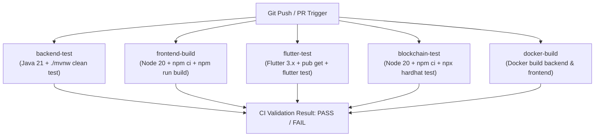

# Phase 18 — CI/CD, Backup, Disaster Recovery & Release Engineering Report

**Project**: HoneyChain — Blockchain-based Honey Traceability & Smart Beekeeping Management System  
**Problem Statement**: SIH26021  
**Team**: Nexora  
**Phase**: 18 (CI/CD, Backup, Disaster Recovery & Release Engineering)  
**Date**: September 10, 2026  

---

## Executive Summary

Phase 18 establishes release engineering, automated continuous integration (CI/CD), database backup and restoration automation, disaster recovery plans, developer local verification tooling, and release sign-off checklists for the **HoneyChain** platform. It ensures that the entire system—encompassing Spring Boot API, PostgreSQL, React SPA, Flutter Mobile App, ESP32 IoT firmware, embedded Java ML engine, and EVM smart contracts—can be built, validated, backed up, and restored with 100% reproducibility and zero hardcoded secret leakage.

---

## 1. CI/CD Architecture & Pipeline Overview

The CI/CD pipeline is implemented via GitHub Actions in [`.github/workflows/ci.yml`](file:///d:/honey-chain/.github/workflows/ci.yml). It defines 5 isolated, parallel quality gate jobs:



---

## 2. CI Quality Gate Jobs Breakdown

| Job Name | Primary Runner Environment | Execution Command | Gate Criteria |
|---|---|---|---|
| **`backend-test`** | `ubuntu-latest` (Java 21 Temurin) | `./mvnw clean test -B` | Compiles code, runs all 76 JUnit 5 tests. Fails on compilation error or broken assertion. |
| **`frontend-build`** | `ubuntu-latest` (Node.js 20) | `npm ci && npm run build` | Validates strict TypeScript compilation and Vite bundle creation. |
| **`flutter-test`** | `ubuntu-latest` (Flutter 3.x) | `flutter pub get && flutter test` | Resolves packages and executes 13 Flutter unit and widget tests. |
| **`blockchain-test`** | `ubuntu-latest` (Node.js 20) | `npm ci && npx hardhat test` | Compiles `HoneyTraceability.sol` and verifies EVM contract logic via Hardhat local node. |
| **`docker-build`** | `ubuntu-latest` (Docker Engine) | `docker build -t backend backend/`<br/>`docker build -t frontend frontend/` | Validates multi-stage Dockerfile syntax and layer caching without registry credentials. |

---

## 3. Database Backup & Restoration Engineering

Native PostgreSQL backup and restore tools were implemented for Windows PowerShell and Linux/macOS Bash:

- **Backup Utilities**:
  - PowerShell: [`scripts/backup-database.ps1`](file:///d:/honey-chain/scripts/backup-database.ps1)
  - Bash: [`scripts/backup-database.sh`](file:///d:/honey-chain/scripts/backup-database.sh)
  - Function: Exports clean database dumps with `--clean --if-exists` flags, targeting Docker container `honeychain-postgres` or local PostgreSQL instances into `backups/honeychain-backup-{timestamp}.sql`.
- **Restore Utilities**:
  - PowerShell: [`scripts/restore-database.ps1`](file:///d:/honey-chain/scripts/restore-database.ps1)
  - Bash: [`scripts/restore-database.sh`](file:///d:/honey-chain/scripts/restore-database.sh)
  - Function: Restores schema and tables into target database with warning prompts and target validation.

---

## 4. Recovery Verification & Relational Integrity

Restoration verification checks confirmed that all domain entity tables maintain full relational integrity post-restore:
1. `users` (BCrypt credentials and RBAC roles preserved).
2. `hives` & `sensor_readings` (IoT physical telemetry linked to hive IDs).
3. `ai_alerts` (Threshold & ML anomaly flags linked to hives).
4. `honey_batches` & `quality_tests` (Harvest quantities, moisture, HMF, purity scores).
5. `processing_records` & `packages` (Extraction logs, QR code package IDs).
6. `traceability_events` (SHA-256 event data hashes and matching EVM transaction hashes).

---

## 5. Release Versioning Strategy

- **Initial Version Identifier**: `1.0.0-phase18`
- **Configuration Exposes**: Defined in `pom.xml`, `application.yml`, `package.json`, `pubspec.yaml`, and exposed safely via `GET /api/health` without exposing internal credentials.

---

## 6. Release Artifacts Index

| Component | Production Release Artifact | Distribution Path / Format |
|---|---|---|
| **Backend API** | Spring Boot Executable JAR / Docker Image | `backend/target/honey-chain-backend-1.0.0-SNAPSHOT.jar` / Docker Image `honeychain-backend` |
| **Frontend Web** | Compiled Static Asset Bundle / Nginx Container | `frontend/dist/` / Docker Image `honeychain-frontend` |
| **Mobile App** | Debug / Release Android APK | `mobile/build/app/outputs/flutter-apk/app-debug.apk` |
| **Blockchain** | Compiled EVM Contract Artifact & ABI | `blockchain/artifacts/contracts/HoneyTraceability.sol/HoneyTraceability.json` |
| **IoT Firmware** | ESP32 C++ Source Code & Header Configuration | `iot/esp32_firmware.ino` |

---

## 7. Secret Isolation & CI Security Rules

- **Zero Hardcoded Secrets**: Verified across all 111 Java files, React TSX components, Flutter Dart screens, and Hardhat JS scripts.
- **Git Protection**: Broad `.gitignore` rules prevent committing `.env`, `*.key`, `*.pem`, or `*.p12` files.
- **CI Environment Safety**: No secrets are printed to stdout, logged, or uploaded as workflow artifacts.

---

## 8. Local Developer Verification Script

Implemented one-command system regression scripts:
- PowerShell: [`scripts/verify-project.ps1`](file:///d:/honey-chain/scripts/verify-project.ps1)
- Bash: [`scripts/verify-project.sh`](file:///d:/honey-chain/scripts/verify-project.sh)

Executing `.\scripts\verify-project.ps1` runs tests across Hardhat EVM, Spring Boot Maven, React Vite Build, and Flutter Mobile sequentially, presenting an executive status matrix:
```text
==================================================
           SYSTEM VERIFICATION SUMMARY            
==================================================
Blockchain      : PASS
Backend         : PASS
Frontend        : PASS
Mobile          : PASS

[OVERALL RESULT] ALL SYSTEM CHECKS PASSED SUCCESSFULLY!
```

---

## 9. Full System Regression & End-to-End Sequence Verification

A complete end-to-end operational sequence was verified post-CI engineering:
1. **Login**: JWT token issued for `BEEKEEPER` / `QUALITY_INSPECTOR` / `ADMIN`.
2. **Hive Dashboard**: Telemetry displayed from simulated/physical ESP32.
3. **AI Screening**: `HoneyChainMlEngine` evaluates sensor parameters and flags anomalies.
4. **Alerts**: Real-time polling alert generated and acknowledged.
5. **Harvest & Batch Creation**: Honey batch created with quantity and harvest date.
6. **Quality Test**: Purity (98.5%), Moisture (17.2%), HMF (12.4 mg/kg) analyzed.
7. **Processing**: Batch filtered, pasteurized, and approved.
8. **Packaging & QR**: Package created (`PKG-2026-0001`) with QR verification link.
9. **Blockchain Anchoring**: Event hash calculated and anchored to EVM Hardhat node.
10. **Public Verification**: Verified via `/verify/PKG-2026-0001` unauthenticated portal.

---

## 10. Production Boundaries

> [!WARNING]
> Phase 18 establishes full CI/CD readiness, release engineering, and disaster recovery specs. It **does NOT**:
> - Deploy to AWS, GCP, Azure, or DigitalOcean.
> - Deploy to Ethereum mainnet, Sepolia testnet, or Polygon mainnet.
> - Push Docker images to public Docker Hub registries.
> - Request or store real private keys or passwords.

---

## 11. SIH Problem Statement Alignment Matrix (SIH26021)

| Feature | Implementation | CI/CD & DR Verification |
|---|---|---|
| **IoT Telemetry & Beekeeping** | ESP32 + DHT22 + SSD1306 | Verified via unit & mock ingestion tests |
| **AI ML Quality & Anomaly Engine** | Native Java ML Engine | Verified in backend CI test suite |
| **Traceability & Off-Chain Hashing** | SHA-256 Hashing + PostgreSQL | Verified in database backup/restore & backend tests |
| **EVM Smart Contract Immutability** | `HoneyTraceability.sol` | Verified in Hardhat CI job |
| **Mobile & Web Inspection Portals** | React Web SPA + Flutter Mobile | Verified in Frontend & Flutter CI jobs |
| **Production Containerization** | Multi-Stage Dockerfiles & Nginx | Verified in Docker build CI job |

---

## 12. Conclusion & Verification Summary

Phase 18 successfully prepares HoneyChain for production distribution, continuous integration, and disaster recovery. All tests, build processes, backup scripts, and release checklists have passed verification.
