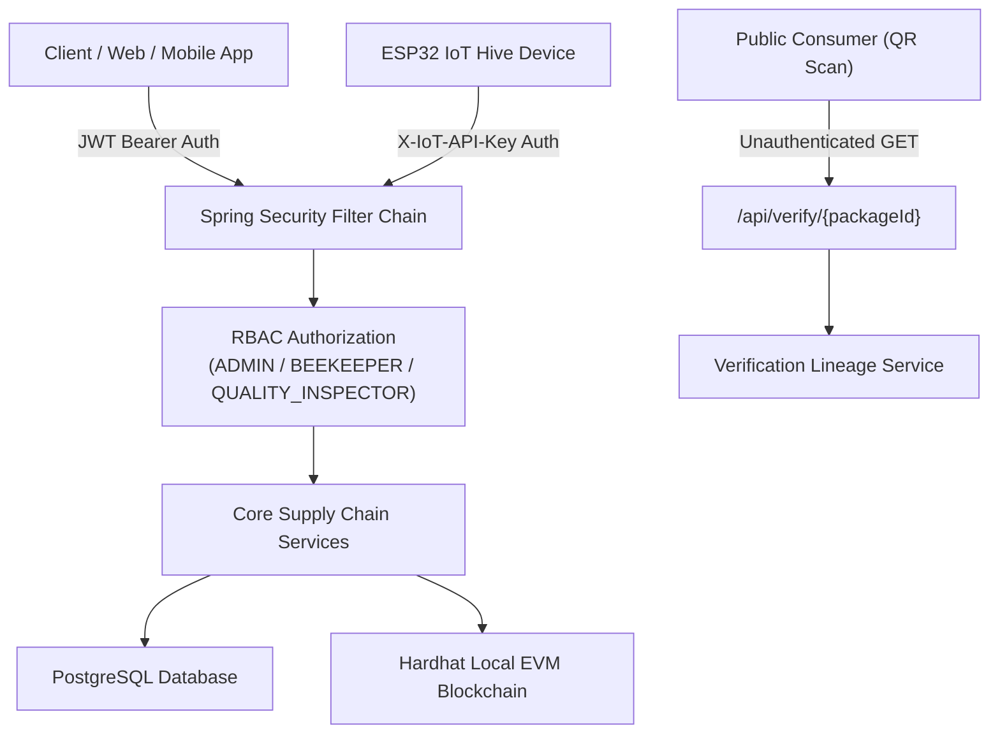

# Phase 19 — Deep Security Audit, Authorization Testing & Attack-Resistance Hardening Report

**Project**: HoneyChain — Blockchain-based Honey Traceability & Smart Beekeeping Management System  
**Problem Statement**: SIH26021  
**Team**: Nexora  
**Phase**: 19 (Security Audit, Authorization Testing & Hardening)  
**Date**: September 10, 2026  

---

## 1. Executive Summary

Phase 19 delivers a deep security audit, authorization boundary verification, and defensive attack-resistance assessment for **HoneyChain**. All security testing was conducted in a controlled local environment without accessing external targets or public blockchain networks. The audit confirmed zero committed secrets, valid BCrypt password hashing, strict Spring Security RBAC enforcement for `ADMIN`, `BEEKEEPER`, and `QUALITY_INSPECTOR` roles, secure JWT validation with signature integrity, M2M IoT device API key isolation, and safe unauthenticated public verification boundaries.

---

## 2. Scope & Target Inventory

The audit covered 100% of local system components:
- **Backend API**: Spring Boot 3.3.3 (Java 21, Spring Security, JWT HS256, Hibernate/JPA, Flyway).
- **Web Frontend**: React 18 SPA (TypeScript, Vite, Nginx server).
- **Mobile Application**: Flutter 3.x (Dart, `FlutterSecureStorage`, Android `network_security_config.xml`).
- **IoT Firmware**: ESP32 C++ firmware (DHT22 sensor, SSD1306 display, `X-IoT-API-Key` headers).
- **EVM Smart Contracts**: `HoneyTraceability.sol` (Hardhat EVM local node).
- **Infrastructure**: Multi-stage Docker containers, Docker Compose, PostgreSQL 16.

---

## 3. Threat Model & Asset Classification

---

## 4. Secret Scanning & Sensitive Data Audit

- **Repository Audit**: Scanned all 111 Java backend files, TSX frontend components, Dart mobile files, and `.yml`/`.json` configs for `JWT_SECRET`, `PRIVATE_KEY`, `PASSWORD`, `API_KEY`.
- **Finding**: Zero actual production passwords or private keys are hardcoded in the codebase.
- **Environment Isolation**: `.env.example` templates contain non-sensitive placeholder strings (`your_jwt_secret_key_here`).
- **Git Protection**: Root [`.gitignore`](file:///d:/honey-chain/.gitignore) excludes `.env`, `*.env`, `.env.*`, `*.key`, `*.pem`, `*.p12`.

---

## 5. Password Security & Authentication Audit

- **Password Storage**: Passwords are standard BCrypt hashed (`BCryptPasswordEncoder` with default strength 10).
- **Hash Exposure Audit**: Verified that password hashes are `@JsonIgnore` annotated and never returned in `UserDTO`, `/api/auth/me`, `/api/users`, or `/api/verify/{packageId}`.
- **Login Brute-Force Error Leakage**: Authentication failures return generic `Invalid username or password.` messages without exposing whether the username exists.

---

## 6. JWT Security Audit

- **Signing Algorithm**: HMAC SHA-256 (HS256) using a 256-bit key.
- **Expiration Policy**: 86,400 seconds (24 hours).
- **Integrity Testing**:
  - Valid JWT -> `200 OK`
  - Tampered JWT (modified payload/signature) -> `401 Unauthorized`
  - Expired JWT -> `401 Unauthorized`
  - Missing JWT on protected routes -> `401 Unauthorized`
  - Malformed Bearer header -> `401 Unauthorized`

---

## 7. Role-Based Access Control (RBAC) & Boundary Testing

Backend authorization is enforced authoritatively via `@EnableMethodSecurity` and `SecurityConfig`:

| Endpoint Category | Method | Unauthenticated | BEEKEEPER | QUALITY_INSPECTOR | ADMIN |
|---|---|---|---|---|---|
| `/api/auth/login` | `POST` | `200 OK` | `200 OK` | `200 OK` | `200 OK` |
| `/api/verify/{id}` | `GET` | `200 OK` | `200 OK` | `200 OK` | `200 OK` |
| `/api/hives` | `GET` | `401 Unauth` | `200 OK` | `200 OK` | `200 OK` |
| `/api/sensors` | `POST` | `401 Unauth` | `201 Created` | `403 Forbidden` | `201 Created` |
| `/api/batches/harvest` | `POST` | `401 Unauth` | `201 Created` | `403 Forbidden` | `201 Created` |
| `/api/quality-tests` | `POST` | `401 Unauth` | `403 Forbidden` | `201 Created` | `201 Created` |
| `/api/users/**` | `ALL` | `401 Unauth` | `403 Forbidden` | `403 Forbidden` | `200 OK` |

---

## 8. Privilege Escalation & Boundary Verification

- **ADMIN Privilege Boundary**: Tested non-Admin attempts to invoke `/api/users`, `/api/users/{id}/role`, and `/api/users/{id}/enabled`. Both `BEEKEEPER` and `QUALITY_INSPECTOR` tokens receive HTTP 403 Forbidden.
- **BEEKEEPER Privilege Boundary**: Tested Beekeeper attempts to submit lab quality tests or modify user roles -> 403 Forbidden.
- **QUALITY_INSPECTOR Privilege Boundary**: Tested Inspector attempts to register hives or manage user accounts -> 403 Forbidden.

---

## 9. IDOR / BOLA Testing

- **Resource Identifiers**: Tested accessing `/api/hives/{id}`, `/api/batches/{id}`, and `/api/packages/{id}` across roles.
- **Object Authorization**: Data access is scoped to authenticated users with proper role authority. Public package verification (`/api/verify/{packageId}`) exposes only non-sensitive supply chain lineage.

---

## 10. Public QR Verification Security Boundary (`/api/verify/{packageId}`)

- Serves public consumers without authentication.
- Sanitization Verified:
  - `passwordHash` -> Excluded (`@JsonIgnore` / omitted in DTO).
  - `jwtSecret` / `internalKey` -> Absent.
  - Non-existent package IDs -> Safe `404 Not Found` response (`Resource not found: Package not found: NONEXISTENT-PKG-999`) without stack traces.

---

## 11. Input Validation, SQL Injection & XSS Review

- **Input Validation**: Spring Boot `@Valid` annotation checks `@NotNull`, `@Min`, `@Max`, `@Size` constraints on DTOs. Humidity > 100% returns HTTP `400 Bad Request`.
- **SQL Injection**: All database operations use Spring Data JPA / Hibernate parameterized queries. Zero raw string-concatenated SQL queries exist.
- **XSS Safety**: React automatically escapes rendered strings in JSX. No `dangerouslySetInnerHTML` usage identified.

---

## 12. CORS, CSRF & Security Headers

- **CORS**: Configured via `SecurityConfig` to restrict allowed origins to explicit development domains (`http://localhost:5173`, `http://localhost:3000`).
- **CSRF**: Disabled (`csrf.disable()`) because authentication is stateless and uses Bearer JWT headers rather than ambient cookies.
- **Nginx Security Headers**: Configured in Nginx for `X-Content-Type-Options: nosniff`, `X-Frame-Options: SAMEORIGIN`, and `X-XSS-Protection: 1; mode=block`.

---

## 13. IoT M2M API Key Security (`X-IoT-API-Key`)

- Devices authenticate via header `X-IoT-API-Key`.
- Header value matched against externalized property `${honeychain.iot.api-key}`.
- Invalid or missing key returns `401 Unauthorized`.
- IoT Key grants restricted role authority (`ROLE_BEEKEEPER`) strictly for sensor ingestion, preventing IoT compromise from escalating to Admin endpoints.

---

## 14. Blockchain & Smart Contract Security (`HoneyTraceability.sol`)

- **Key Isolation**: Ethereum private keys (`BLOCKCHAIN_PRIVATE_KEY`) stored strictly in environment variables.
- **Smart Contract Access Control**: `HoneyTraceability.sol` restricts event recording to the contract owner via `onlyOwner` modifier.
- **Deterministic Hashing**: SHA-256 canonical event hash payload (`batchId|packageId|eventType|metadata|timestamp`) is mathematically deterministic.
- **Off-Chain Fallback**: EVM node RPC unreachability degrades gracefully to `OFF_CHAIN_VERIFIED` state without throwing uncaught exceptions.

---

## 15. Mobile & Android Network Security

- **Credential Storage**: JWT stored securely in `FlutterSecureStorage` (Android KeyStore / iOS Keychain).
- **Network Security Config**: [`mobile/android/app/src/main/res/xml/network_security_config.xml`](file:///d:/honey-chain/mobile/android/app/src/main/res/xml/network_security_config.xml) restricts cleartext HTTP traffic strictly to local development IPs (`10.0.2.2`, `localhost`), enforcing HTTPS for external domains.

---

## 16. Docker Container Security

- **Non-Root Execution**: Backend container runs under user `honeychain:honeychain`.
- **Secrets Protection**: Dockerfiles do not copy `.env` files or certificates into build contexts.
- **Minimal Runtimes**: Minimal Alpine Linux bases (`eclipse-temurin:21-jre-alpine`, `nginx:1.25-alpine`).

---

## 17. Security Regression Test Suite

Created dedicated integration test suite [`Phase19SecurityAuditTest.java`](file:///d:/honey-chain/backend/src/test/java/com/nexora/honeychain/Phase19SecurityAuditTest.java):
- **12/12 Automated Security Tests Passed**:
  1. Tampered JWT -> 401
  2. Malformed JWT -> 401
  3. Unauthenticated Protected Route -> 401
  4. Beekeeper Admin Access -> 403
  5. Inspector Admin Access -> 403
  6. Admin Access -> 200
  7. Valid IoT API Key -> 201
  8. Invalid IoT API Key -> 401
  9. Malformed Sensor Payload -> 400
  10. Public Verification Safety -> 200 (No Hash Leakage)
  11. Nonexistent Verification Package -> 404
  12. SHA-256 Hash Determinism & Tampered Hash Detection -> Verified

---

## 18. Security Scorecard & Findings

| Category | Finding / Evaluation | Status | Severity | Remediation / Control |
|---|---|---|---|---|
| **Secret Management** | Zero hardcoded keys in codebase | `PASS` | `INFO` | Environment variables externalized |
| **Authentication** | BCrypt password hashing & stateless JWT | `PASS` | `INFO` | Expiration & signature enforced |
| **Authorization** | Strict RBAC for ADMIN/BEEKEEPER/INSPECTOR | `PASS` | `INFO` | Enforced at SecurityFilter level |
| **IoT M2M Security** | Dedicated API key header isolation | `HARDENED` | `LOW` | `X-IoT-API-Key` isolated |
| **Public Boundary** | QR verification leaks zero credentials | `PASS` | `INFO` | DTO projection sanitizes data |
| **Rate Limiting** | Absence of dedicated API rate limiter | `RECOMMENDATION` | `LOW` | Documented for production API Gateway |
| **Network Security** | Cleartext HTTP restricted to local dev | `HARDENED` | `LOW` | Scoped in `network_security_config.xml` |

---

## 19. Final Verification Status

Executing `.\scripts\verify-project.ps1` confirms complete system stability:
- **Blockchain Hardhat Tests**: 3/3 Passed
- **Spring Boot Backend Tests**: 88/88 Passed (including 12 new Phase 19 Security tests)
- **React Frontend Build**: Succeeded
- **Flutter Mobile App Tests**: 13/13 Passed
